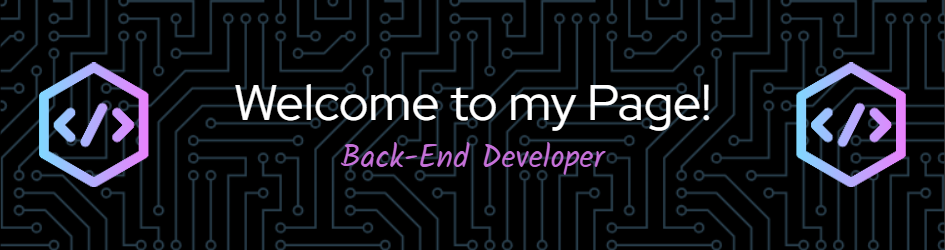

<h1 align="center">Hello there! 👋 I'm Nurlan Shukurov</h1>
<h3 align="center">A Passionate Back-End Developer from Azerbaijan</h3>
<h3 align="left">👨‍💻 About Me</h3> 
 I am a dedicated back-end developer with a strong interest in problem-solving and coding. Currently, I am exploring full-stack development with a focus on C# and ASP.NET to broaden my expertise.    - 🔭 I’m currently working on various projects, including a Mini E-Commerce API and an ASP.NET MVC project during my internship at Jet Academy. - 📚 I'm continually learning and experimenting with new technologies, including ASP.NET Core Microservices and Docker. - ⚡ In my free time, I enjoy watching movies and exploring the latest in tech trends. 

<h3 align="left">🛠️ Languages and Tools</h3> 
                                    

<h3 align="left">🔥 My Stats</h3> 
  

  

